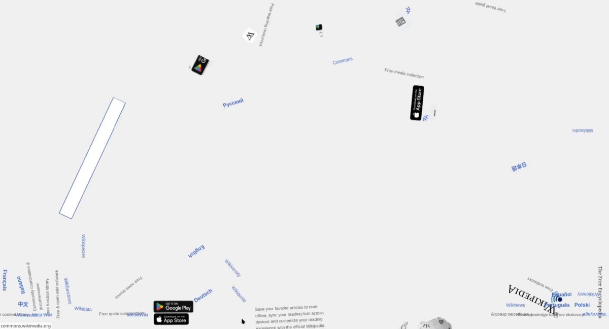
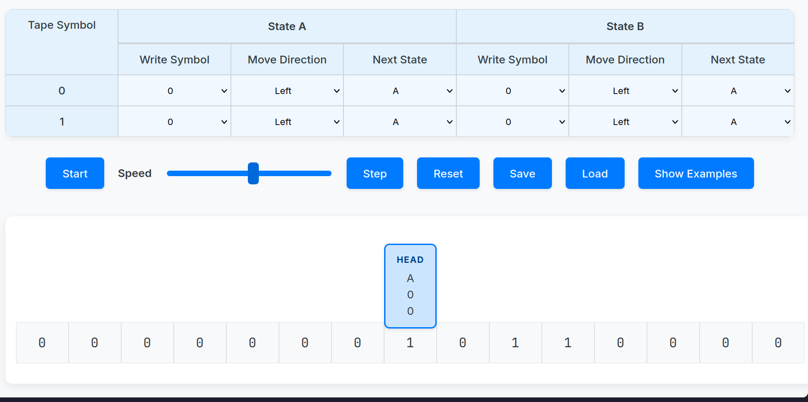
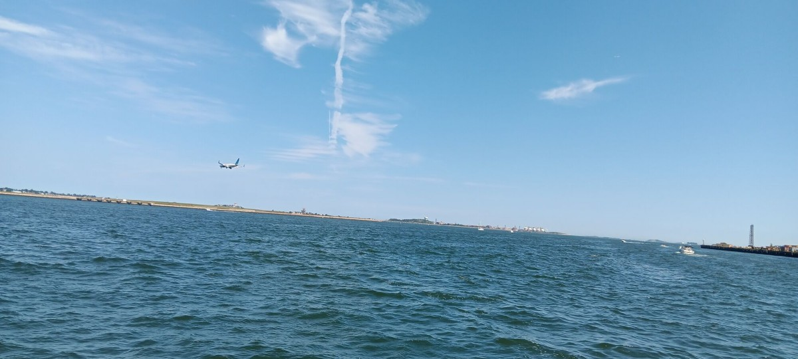
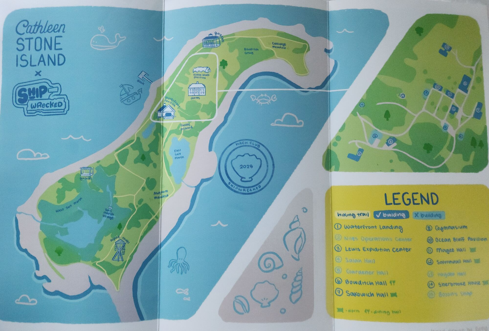
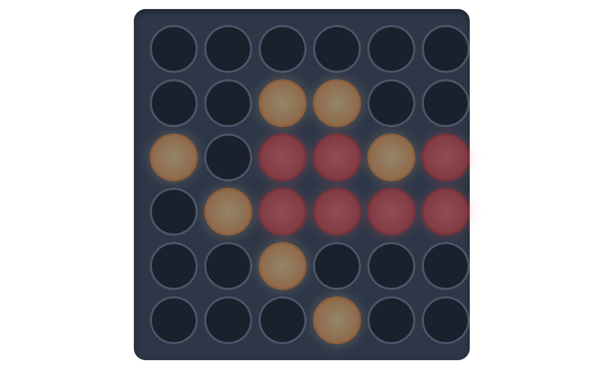
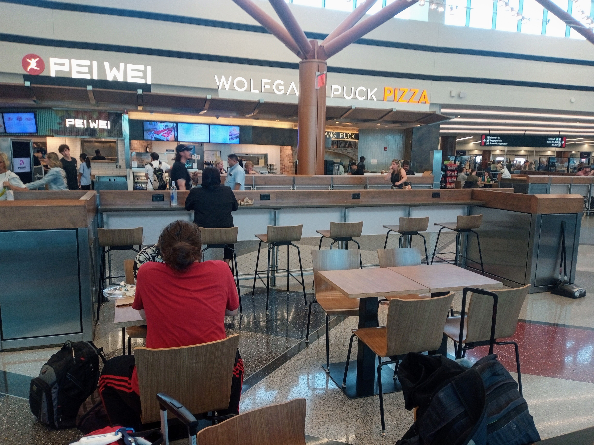

Last April, I was minding my own business when I received a curious email into my inbox.

> 1. Hack Club is renting an island.
> 2. We are hosting a hackathon.
> 3. Anyone who ships 4 projects gets to come. Flight stipends available!
> 4. Dates are August 8th - 11th. Boston, USA.

I'd signed up to [Hack Club](https://hackclub.com) mailing lists in the past since they run a variety of coding activities. However, email particularly stood out to me. I've always wanted to visit America, and it seemed like they would be offering me a free flight!

Following the link led me to a sign-up page where I entered my details to register my interest. I spread the word of this event to the other coders I knew, and soon it reached the 5,000 signup threshold to be given the green light.

Hack Club is a non-profit organisation that has received some [generous donations](https://eu.burlingtonfreepress.com/story/news/2021/11/26/hack-club-shelburne-vt-grant-elon-musk-teens-coding/8552542002/) in the past, but they still can't afford to give away such a great trip for free. To earn my place at the event, I needed to pass The Bay.

## The Bay

The Bay was an online platform designed by Hack Club specifically for this event. You tracked your time spent coding projects with their WakaTime server [Hackatime](https://hackatime.hackclub.com/) and submitted any completed projects for review by the Shipwrecked moderators.

Approved projects granted you a number of "shells" relative to how many hours were spent creating said project. These shells could be spent on many different items from their shop, from Flipper Zeros to 3D printers. However, the grand prize was a ticket for the Shipwrecked hackathon in Boston. This cost the small sum of 60 hours total. Travel stipends were also available, at a conversion rate of 1 hour → $10 for a flight from London Heathrow to Boston Logan International.

After checking Skyscanner to see return flights would charge an entire £400 (~ $550), I checked the clauses for Shipwrecked and saw if I programmed for 100 hours total they would fully cover my flight regardless of how expensive.

Now I had the 100-hour goal in mind, it was time to start programming.

## Some Notable Projects

### Gravify



I had found an interesting library called [html-to-image](https://github.com/bubkoo/html-to-image) that could convert DOM elements into images I could manipulate with JavaScript. Whilst that library was sitting in the back of my mind, I stumbled across the [Matter.js](https://brm.io/matter-js/) physics simulation library. The library supported custom PNGs as input to the physics simulation, so I decided to combine these two libraries together and recreate something very similar to [Google Gravity](https://mrdoob.com/projects/chromeexperiments/google-gravity/).

Going through the [MDN Web Docs](https://developer.mozilla.org/en-US/) to learn how to build a browser extension was far smoother than I had anticipated. I was comfortable writing JavaScript and not much boilerplate was required to hook into the Browser APIs. After not too long, [Gravify](https://github.com/ethan-hawksley/gravify-extension) was created.

### Turing Machine Simulator



After visits to Bletchley Park and diving into more theoretical computer science, I knew I wanted to build a Turing machine.

Turing machines are a model for computing first devised by Alan Turing in 1948. They consist of an infinite roll of tape marked out into squares, a "head" that points to a single square at a time, and a set of states and instructions. Each cycle, the Turing machine reads the value of the tape underneath itself, compares it to the corresponding instruction, writes a new symbol onto the tape, and finally either moves left or right along the tape.

Despite their limited nature, they can provably carry out any calculation and are very useful for proving new theorems in computer science. I did some research and couldn't find a simulator online that I was content using, so I built my own.

I was still studying a React course at the time, so I wasn't fully confident building UI with JSX components. This led to a lot of repetitive code.

```js
const rightOption = document.createElement('option');
rightOption.value = 'Right';
rightOption.textContent = 'Right';
// ...
```

Looking back at it, it is quite brittle and difficult to debug, but I can thank my understanding of JavaScript fundamentals to framework-less code like this.

## Reaching America

As soon as I got the official go-ahead from the organisers, I booked a flight with British Airways ready to set off for Boston.

Coming alongside me was Oliver Kickl and [Brooklyn Baylis](https://github.com/Brooklyn-Dev), two friends that also qualified for the event. They also put in the hours to earn tickets, and we all came over on the same plane.

The flight took a long eight hours, but after not too long we finally reached America.


Once we arrived at the airport, we set off to EDIC Pier where we laid our picnic blankets and bought some local food. I got to know the other contestants who were there. Many were American, but a surprising amount were from all across the globe, with one even as far as Vietnam!



It didn't take long until we began to set off towards Cathleen Stone Island. The ride was short, but a great opportunity to chat with the other people there, and take some photos. By the time we finally reached the island, we had decided on the structure of our teams already.

Everyone scrambled to claim their beds, but as one of my projects had gone viral, I was given first pick and stayed in the executive suite with the other viral programmers. It was here that I met Daniel, another participant that managed to go viral, and formed a team with him and Oliver.

By the end of the day, we were all invited down to the pavilion to learn about the first project we would be assigned. This hackathon had three projects that we would make total, each themed around a certain idea. The first project was to design a method of communication that wouldn't involve letters or numbers.

## SymbolNotes


In my team with Oliver and Daniel, we decided to create an online peer-to-peer messaging app. Since I had prior experience with the PeerJS library, I suggested that we use that.

As per hackathon tradition, the code we made was hacky and the graphics were rough, but we managed to create a working solution. We released the source code for [SymbolNotes](https://github.com/Thesupernile/SymbolNotes) onto GitHub so that others could examine and learn from it. We made it together over the course of a morning, and submitted it onto The Bay.

## Exploring The Island



With our project complete, we spent the rest of the day exploring the island as a team. The executive suite and pavilion were both very close to the docks, but there was an entire rest of the island still to investigate.

Alongside us were some Americans who knew the area much better than we did, and told plenty of stories about what it was like living in America. As somebody who's only step foot outside Europe once prior, it was very refreshing to hear such different perspectives.

Before long however, it was back to the next challenge.

## Connect Infinity



Our next challenge was to design a creative game that could be played online. We decided to put a spin on the classic game Connect 4, and make it realtime. To prevent it from being over extremely quickly, the game only ends once the entire board is full. Every 4-in-a-row gives a point, most points wins.

Now the team had got used to PeerJS, we decided to use it once again here as it seemed perfectly suited for the task. As a challenge, we designed the code so that lobbies of unlimited size was supported, instead of just groups of two.

This took some more time than the previous project due to its larger scope, but we worked as a team much more efficiently. After a few tireless hours, [Connect Infinity](https://github.com/ethan-hawksley/connect-infinity) was created just in time to present.

We took laptops down to the pavilion and set them up running the game by the shore. The other participants all tried out the game, and it was surprisingly well received! We managed to win a limited edition Shipwrecked shirt, which I still have and wear to this day.

## Perlin Colour


Our final task was to create a project that heavily featured a variety of colours. Daniel had the idea to create a Perlin noise generator that could create plenty of colourful gradients.

After some research on the formulas involved, and a fair bit of trial and error, we ended up with a functioning noise generator implemented with HTML Canvas. I had dabbled with Canvas before, but this was the first time I had implemented a proper renderer using it.

We ended up sleeping on the problem, but once we woke up, we were fully refreshed and fixed the final bugs with the implementation. It was very satisfying to have a proper end product.

The project was presented, and it went down a treat! The prizes were limited edition laptop stickers that I proudly have stuck onto my laptop ever since.

# Returning Home



Alas, all good things must come to an end. It was the final day, so I gathered all my belongings and packed them away into a suitcase. My team attended the closing ceremony and said our goodbyes to the people there. There was so many nice people that I met, and I'll cherish the memories made forever.

I caught an Uber alongside some others also needing a flight back, and returned back to the airport. It was there I said bye to Daniel, as he had a different flight back home. One amusing thing at the airport was the Hack Club official plushies were just over the weight limit and were tripping all the security alarms. I got through just fine, but it caused a right mess!

It was then I also got to see my very first American passport. Having only seen European ones, it was a right culture shock with pages full of landmarks, and a giant eagle on the photo page.

The actual flight was thankfully uneventful, I watched the in-flight entertainment and ate the food, but slowly drifted off to sleep until we landed.

## Reflections

Participating in Shipwrecked is an experience I'll remember forever, and I thank Hack Club and the organisers for helping set up such a wonderful event. I still have maintained contact with several of the other people there, and arrange to meet up with them at future hackathons.

It was also very enjoyable working in teams. Having spent so much of my time programming solo, it was nice bouncing ideas back and forth to come to informed conclusions.

I've done many other things with Hack Club since, but they are perhaps a story for another blog post...

One thing you can take for granted is that I'll absolutely be doing more hackathons in the future!
